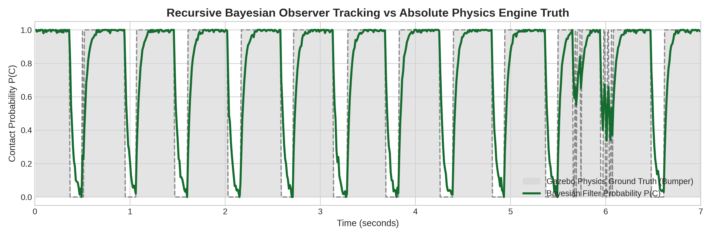

# Go2 Custom Controller

A custom **whole-body locomotion controller** for the **Unitree Go2**, built completely from scratch in **ROS2 Humble**. The project focuses on developing a real-time torque-controlled locomotion stack by combining analytical robot dynamics, probabilistic state estimation, and optimization-based control.

The controller has been developed incrementally, progressing from joint-space position control to a hybrid **Model Predictive Control (MPC) + Cartesian PD** framework capable of balancing, traversing, and generating optimized contact forces for dynamic locomotion.

---

# Demo

## Whole-Body MPC Locomotion

▶ https://youtu.be/vElgerYcuws

## Pure PD Torque Controller

▶ https://youtu.be/iW85iWN7zKw

---

# Features

* Whole-Body Model Predictive Control (MPC)
* Cartesian Pure PD Torque Controller (250 Hz)
* Dynamic Trot Gait Generator
* Analytical Forward & Inverse Kinematics
* Analytical Jacobian Solver
* Ground Reaction Force (GRF) Optimization
* Jacobian Transpose Torque Mapping (`τ = JᵀF`)
* Recursive Bayesian Contact Estimation
* Extended Kalman Filter (EKF) State Estimation
* Velocity Estimation
* Swing/Stance Foot Trajectory Planning
* Hardware-safe Reachability Validation
* ROS2 Humble Compatible

---

# Controller Architecture

```
                 cmd_vel
                    │
                    ▼
          Dynamic Trot Planner
                    │
                    ▼
        Desired Foot Trajectories
                    │
          ┌─────────┴─────────┐
          │                   │
          ▼                   ▼
  Cartesian PD Tracker     MPC Solver
                                │
                                ▼
                 Ground Reaction Forces
                                │
                                ▼
                     Analytical Jacobian
                                │
                          τ = JᵀF Mapping
                                │
          ┌─────────┴─────────┐
          │                   │
          ▼                   ▼
       PD Torque         MPC Torque
                \         /
                 \       /
                  ▼     ▼
              Torque Blending
                    │
                    ▼
             Joint Effort Commands
                    │
                    ▼
                Unitree Go2
```

---

# Mathematical Verification & Runtime Performance

To guarantee deterministic execution at **250 Hz**, all forward kinematics, inverse kinematics, and Jacobians were derived analytically rather than relying on numerical methods during runtime.

A standalone C++ benchmarking framework randomly sampled **80,000** valid robot configurations and compared every analytical solution against the **Pinocchio Rigid Body Dynamics Library**.

| Algorithm                     | Execution Time (µs) |       Maximum Error |
| :---------------------------- | ------------------: | ------------------: |
| Analytical Forward Kinematics |            **0.02** |   **1.6 × 10⁻¹⁶ m** |
| Analytical Inverse Kinematics |            **0.05** | **1.4 × 10⁻¹⁵ rad** |
| Analytical Jacobian           |            **0.03** |      **1.1 × 10⁻⁶** |
| Pinocchio Gravity (RNEA)      |                0.51 |           Reference |
| Pinocchio Mass Matrix (CRBA)  |                0.85 |           Reference |
| Pinocchio Coriolis (RNEA)     |                1.12 |           Reference |

The optimized Ground Reaction Forces generated by MPC are transformed into actuator torques using the analytical Jacobian

```
τ = JᵀF
```

allowing the controller to remain fully deterministic while maintaining real-time performance.

---

# Whole-Body Model Predictive Control

The controller follows a hierarchical architecture.

The gait planner generates desired footholds and contact schedules while the MPC solves a constrained optimization problem to compute optimal Ground Reaction Forces (GRFs) for each stance leg.

These optimized forces are converted into joint torques using the analytical Jacobian

```
τ = JᵀF
```

instead of commanding joint torques directly.

A progressive blending strategy gradually transfers control authority from Cartesian PD tracking to MPC-generated torques, ensuring smooth transitions and stable locomotion.

During runtime the controller continuously publishes

* Desired Joint Positions
* Actual Joint Positions
* PD Torque Contribution
* MPC Torque Contribution
* Final Applied Torque
* Optimized Ground Reaction Forces
* Contact Phase (Swing / Stance)

allowing every stage of the control pipeline to be verified in real time.

---

# Recursive Bayesian Contact Validation

Accurate contact estimation is fundamental for stable legged locomotion.

Rather than relying on simulator bumper sensors for controller feedback, this project estimates foot contact probabilities directly from robot kinematics and inertial measurements.

The estimator

* computes slip velocity
* evaluates a Gaussian likelihood model
* recursively updates contact probabilities using Bayesian Log-Odds
* filters impact transients using a leaky integrator

During development, Gazebo bumper sensors operate exclusively in **Shadow Mode** as a validation reference.

This enables direct comparison between

* Estimated Contact Probability
* Binary Contact State
* Gazebo Ground Truth

to quantify estimation accuracy before removing simulator ground truth entirely.

> **Note:** Ground-truth bumper data is never used for locomotion control. It serves only as an offline benchmark for validating the Recursive Bayesian Contact Estimator.

<p align="center">

</p>

---

# State Estimation

The locomotion stack includes an Extended Kalman Filter (EKF) that fuses

* IMU measurements
* Robot kinematics
* Velocity estimation
* Contact probabilities

to estimate the robot's body state without relying on simulator ground truth.

The Recursive Bayesian Contact Estimator dynamically adjusts measurement confidence based on the estimated stance probability, allowing the EKF to reject unreliable foot measurements during swing while suppressing IMU drift during stance.

---

# Development Progress

## ✅ Stage 1 — Position Control

* Standing Controller
* Position-based Walking
* Dynamic Trot Generator
* Swing Trajectory Planning

---

## ✅ Stage 2 — Torque Control

* Cartesian PD Controller
* Analytical Kinematics
* Analytical Jacobians
* Reachability Validation
* 250 Hz Real-Time Loop
* Velocity Estimation
* EKF State Estimation

---

## ✅ Stage 3 — Whole Body Control

* MPC-based Ground Reaction Force Optimization
* Jacobian Transpose Torque Mapping
* Torque Blending
* Recursive Bayesian Contact Estimation
* Contact-aware Locomotion

---

## 🚧 Current Development

* Terrain Adaptive Locomotion
* Online Foothold Optimization
* Disturbance Recovery
* External Push Recovery
* Uneven Terrain Traversal
* Dynamic Running
* Full State Estimation without Simulator Ground Truth

---

# Project Structure

```
# Project Structure

```text
go2_custom_controller/
│
├── trajectory_generator/
│   ├── trot_gait.cpp
│   └── contact_estimator.cpp
│
├── go2_mpc_controller/
│   ├── dynamic_tracker.cpp
│   ├── mpc_solver.cpp
│   └── robot_model.cpp
│
├── state_estimation/
│   └── ekf_state_estimate.cpp
│
├── go2_joint_experiments/
│   ├── pure_pd_tracker.cpp
│   └── static_stand_balancer.cpp
│
└── README.md
```

---

# Future Work

* Full Whole-Body Controller (WBC)
* Dynamic Terrain Adaptation
* Online Footstep Planning
* Force-based Balance Recovery
* Vision-based Terrain Perception
* Blind Stair Climbing
* Dynamic Bounding & Running
* Hardware Deployment on Unitree Go2

---

# License

MIT License
