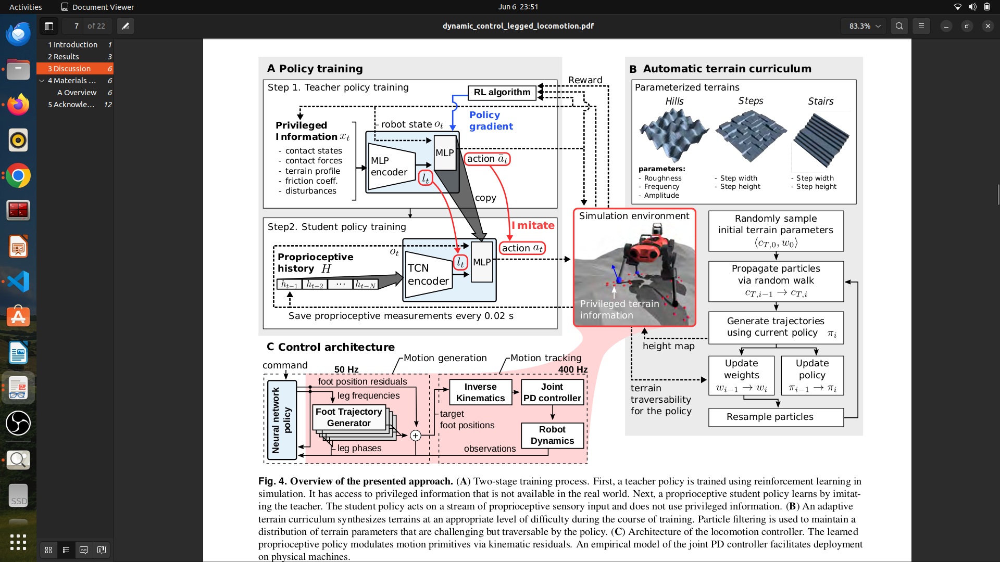

1. Core Concepts:Desired body motion
                        ↓
                Desired foot positions
                        ↓
                Inverse kinematics
                        ↓
                Joint angles
                        ↓
                Motor commands

2. gait generation  :which leg move when , how high and how fast . Generate foot trajectroy over time can be sinusoidal , bezier curve 
                    common Gait - Trot (Diagonal legs together) fast and stable 
                                - Crawl (1 leg at a time) very stable and slow 
                                - Bound (front pair then rair) fast but less stable

                    eg. Foot lift: z=hsin(πt/T) , h= swing height T= gait period 

3. Implementation order should be in below way - 1. Foot trajectory generator 2. Inverse kinematics 3. Joint PID 4. Gait scheduler 5. IMU stabilization(can be marked to be project )

4. Joint  Axes and motion :
        Hip joint:      RotateX (abduction/adduction) - moves leg sideways
        Upper leg:      RotateY (flexion/extension)   - lifts leg forward/back
        Lower leg:      RotateY (knee flexion)        - knee bending
5. Cordinate framing :World Frame {W}
                            |
                            └── Base Link Frame {B} [at center of mass]
                                    |
                                    ├── Left Front Hip Frame {LF_hip}
                                    |       ├── LF Upper Leg Frame
                                    |       └── LF Lower Leg Frame
                                    |           └── LF Foot Frame (End Effector)
                                    |
                                    └── ... (repeat for RF, LH, RH)

6. Forward Kinematics :Problem: Given joint angles (θ_hip, θ_thigh, θ_calf), find foot position (x, y, z).
        Step-by-step numerical example:

        Assume:

        Hip offset: [0.1, 0.1, 0] m
        Upper leg: 0.2 m along X
        Lower leg: 0.2 m along X
        Foot offset: 0.05 m along Z

        Angles: θ_hip = 0.2 rad, θ_thigh = -0.5 rad, θ_calf = 0.8 rad

        Code
        ```
        Step 1: Start at origin
        p = [0, 0, 0]

        Step 2: Add foot offset (already in foot frame)
        p = [0, 0, 0.05]

        Step 3: Rotate by calf angle (0.8 rad about Y)
        cos(0.8) ≈ 0.697, sin(0.8) ≈ 0.717
        x_new = x·cos(0.8) - z·sin(0.8) = 0 - 0.05·0.717 ≈ -0.036
        z_new = x·sin(0.8) + z·cos(0.8) = 0 + 0.05·0.697 ≈ 0.035
        p = [−0.036, 0, 0.035]

        Step 4: Add lower leg offset [0.2, 0, 0]
        p = [0.164, 0, 0.035]

        Step 5: Rotate by upper leg angle (−0.5 rad about Y)
        cos(-0.5) ≈ 0.878, sin(-0.5) ≈ -0.479
        x_new = 0.164·0.878 - 0.035·(-0.479) ≈ 0.161
        p = [0.161, 0, 0.115]

        ... continue for remaining transforms ```

7. Inverse Kinematics Problem: Given desired foot position (x_d, y_d, z_d), find joint angles.
        Step 1: Hip angle (abduction/adduction)
        r² = y² + z²  (distance from hip to foot in Y-Z plane)

        l0 = sum of all Y-offsets in the leg chain
        (includes hip offset, any fixed offsets)

        The foot must stay on a circle of radius l0 from the hip joint center.

        hip_angle = atan2(y, z) - offset_compensation
        
        Intuition:

                If the foot is directly in front (Z-axis), hip angle = 0
                If foot moves left (−Y), hip angle becomes negative
                The constraint l0 represents the fixed lateral offsets

        Step 2: Thigh and calf angles (2-DOF arm problem)
        After removing hip rotation, we have a 2-DOF planar arm in the X-Z plane:
        Segments: upper_leg (length L1), lower_leg (length L2)
        End effector position: (x, z) relative to hip in X-Z plane

        Problem: Find angles θ1 (thigh), θ2 (calf) such that:
        x = L1·cos(θ1) + L2·cos(θ1 + θ2)
        z = L1·sin(θ1) + L2·sin(θ1 + θ2)

        Solution using law of cosines:
        distance_to_foot = sqrt(x² + z²)
        d = distance_to_foot

        If d > L1 + L2: UNREACHABLE
        If d < |L1 - L2|: UNREACHABLE (foot too close)

        cos(θ2) = (d² - L1² - L2²) / (2·L1·L2)
        θ2 = ±acos(...)  [choose based on knee direction]

        θ1 = atan2(z, x) - atan2(L2·sin(θ2), L1 + L2·cos(θ2))

        Step 3:Jacobian Computation
                Purpose: Relate joint velocities to end-effector velocities.
                                x ˙ e e = J ( θ ) ⋅ θ

        Step 4 :Foot Position Calculation in Real Robot
                Input: cmd_vel (linear.x, linear.y, angular.z)
                current_body_pose (roll, pitch, yaw, x, y, z)

                Step 1: Body controller transforms input
                ├─ Apply body pose offset to each leg's desired position
                ├─ Rotate foot trajectory based on body orientation
                └─ Output: target_foot_positions[4]

                Step 2: Inverse kinematics
                for each leg:
                        IK(target_foot_positions[i]) → joint_angles[i*3 : i*3+3]

                Step 3: Joint command generation
                Output: joint_trajectory_msg with 12 joint angles

                Step 4: Send to hardware/controller
                joint_group_effort_controller executes with PID gains


8. GAIT GENERATION 3.1 Trot Gait (Most Common for Quadrupeds)

                Definition: Diagonal legs move in pairs:

                Stance phase (60%): Leg on ground, moving backward relative to body
                Swing phase (40%): Leg in air, moving forward to next position

                Phase signal usage:
                stance_phase_signal ∈ [0, 1]: How far through stance phase (0 = just touched, 1 = about to lift)
                swing_phase_signal ∈ [0, 1]:  How far through swing phase (0 = just lifted, 1 = about to land)

                At any given time, only ONE of these is nonzero for each leg.

                Stance vs Swing Phases 
                Stance :// During stance: create backward motion (horizontal)
                        if(stance_phase_signal > swing_phase_signal)
                        {
                        x = (step_length / 2) * (1 - (2 * stance_phase_signal));
                        // step_length/2 starts at +step_length/2 and goes to -step_length/2
                        
                        y = -gait_config->stance_depth * cos((PI * x) / step_length);
                        // Vertical bounce (cosine curve for smooth contact)
                        }

                Swing : // During swing: use Bézier curve for smooth trajectory
                        else if(stance_phase_signal < swing_phase_signal)
                        {
                        // Bézier curve with control points
                        for(unsigned int i = 0; i < num_control_points; i++)
                        {
                                float coeff = C(n,i) * pow(swing_phase_signal, i) 
                                                * pow((1 - swing_phase_signal), (n - i));
                                x += coeff * control_points_x[i];
                                y -= coeff * control_points_y[i];
                        }
                        // Creates smooth arc forward and upward
                        }

9. Dynamics and Forces :Raibert Heuristic (used in CHAMP):
                        Instead of computing exact ZMP, use empirical relationship:

                        step_length = (stance_duration / 2) × target_velocity

                        This automatically balances the dynamics:
                        - Want to go faster → take longer steps → CoM moves forward
                        - Longer steps → feet further apart → larger support polygon
                        - Larger polygon → ZMP can move further before tipping

                        Contact Forces and Constraints:
                        Each foot-ground contact has:

                        Normal force: F z (perpendicular to ground, can only push, not pull)
                        Friction forces: F x , F y (parallel to ground)
                        Constraint: F z ≥ 0 (contact can only push)
                        Friction cone: F x 2 + F y 2 ≤ μ F z where μ = coefficient of friction

                        Mass Matrix and Rigid Body Dynamics:
                        For CHAMP (simplified model for joint control):

                        Each joint individually: τ i = I i θ ¨ i + b i θ ˙ i + g i ( θ )

                        Where:

                        I i = inertia about joint axis (configuration-dependent)
                        b i = viscous friction coefficient
                        g i ( θ ) = gravity component for this joint

                        Gravity Compensation
                        Problem: When a leg extends, gravity pulls it down. Need extra torque to maintain position.
                        Solution :// Gravity torque on upper leg:
                        // Moment = mass × g × distance_from_joint_to_com

                        // Example for extended leg (holding knee extended):
                        // τ_calf = m_calf × g × l_calf/2 × cos(current_angle)

                        // This torque decreases as leg rotates up (angle increases)

                        In PID control:
                        // Command torque = PID_output + gravity_feedforward
                        τ_cmd = K_p * error + K_d * error_rate + τ_gravity

                        // With gravity compensation, PID only needs to handle tracking errors
                        // Makes controller more stable and responsive

                        Contact and Friction Model

                        Point contact model (used in CHAMP):

                        Assume foot makes point contact with ground
                        Model foot as massless (mass concentrated in leg links)
                        Ground modeled as rigid plane at Z = z_ground

                        Friction model:

                        Dry (Coulomb) friction: F f r i c t i o n = μ F n o r m a l
                        In Gazebo simulator: friction coefficient tuned empirically
                        Typical values: 0.5-1.0 for rubber on concrete

10. Ros2 control framework :
                        ┌─────────────────────────────────────┐
                        │     High-level Node                 │
                        │  (quadruped_controller_node)        │
                        │                                     │
                        │  - Receives: cmd_vel (Twist)       │
                        │  - Computes: kinematics, gait      │
                        │  - Outputs: joint trajectories     │
                        └──────────────┬──────────────────────┘
                                │ joint_group_effort_controller/command
                                ▼
                        ┌─────────────────────────────────────┐
                        │  JointTrajectoryController          │
                        │  (ros2_control managed)             │
                        │                                     │
                        │  - Receives: trajectories           │
                        │  - Runs: PID loops @ 250 Hz        │
                        │  - Outputs: effort commands         │
                        └──────────────┬──────────────────────┘
                                │ effort signals
                                ▼
                        ┌─────────────────────────────────────┐
                        │  Hardware Interface / Simulator     │
                        │  (Gazebo physics or real motors)    │
                        │                                     │
                        │  - Receives: effort commands        │
                        │  - Simulates: physics               │
                        │  - Outputs: joint states            │
                        └──────────────┬──────────────────────┘
                                │
                                ▼
                                Robot Motion

        Complete signal flow :
                Input:  cmd_vel (geometry_msgs/msg/Twist)
                linear.x, linear.y (m/s)
                angular.z (rad/s)

                ↓

                QuadrupedController Node:
                ├─ LegController::velocityCommand()
                │   ├─ Raibert heuristic: step_length = (stance_duration/2) * vel_x
                │   ├─ Transform leg: rotate & translate desired foot positions
                │   └─ Output: target_foot_positions[4]
                │
                ├─ BodyController::poseCommand()
                │   └─ Apply body roll/pitch/yaw adjustments
                │
                ├─ Kinematics::inverse()
                │   ├─ For each leg: IK(target_foot_position) → 3 joint angles
                │   └─ Output: joint_positions[12]
                │
                └─ Publish: JointTrajectory with 12 joint positions

                ↓

                JointTrajectoryController (at 250 Hz):
                ├─ For each of 12 joints:
                │   ├─ error = target_position - current_position
                │   ├─ PID calculation
                │   └─ Apply effort_cmd
                │
                └─ Publish: actual joint states & efforts

                ↓

                Gazebo / Real Hardware:
                └─ Execute motion


                TF tree(visualization):
                world
                  └── odom (odometry frame, moves with robot)
                        └── base_link (robot center)
                                ├── lf_hip_link
                                │    ├── lf_upper_leg_link
                                │    │    └── lf_lower_leg_link
                                │    │         └── lf_foot_link
                                ├── rf_hip_link
                                │    └── ...
                                ├── lh_hip_link
                                │    └── ...
                                └── rh_hip_link
                                        └── ...

11. Sim2Real Transfer 
        9.1 Common Challenges
        Challenge	                Cause	                                Mitigation
        Actuator latency	Real motors have 5-50ms delay	Tune PID conservatively, add derivative term
        Sensor noise	           Encoders/IMU have noise	Low-pass filter state estimates
        Friction mismatch	Sim has perfect friction model	Add friction randomization, test on multiple surfaces
        Mass distribution	CoM differs from CAD estimate	Weigh real robot, adjust URDF inertias
        Joint backlash	         Gears have play in real robot	Implement deadband in controller
        Electrical noise	   Real electronics have EMI	Add noise to simulation

        9.2 Actuator Latency Compensation
        In simulation: Command arrives instantly at motor.
        t=0:   Send command over CAN bus
        t=5ms:   Command received by motor controller
        t=8ms:   Motor controller interprets command
        t=12ms:  Motor actually starts accelerating
        t=20ms:  Force reaches peak

12. Explain the role of the Raibert heuristic in quadruped locomotion.
   Ans: The Raibert heuristic is a proportional relationship between desired body velocity and step length: 
                                step_length = (stance_duration / 2) × target_velocity

        It avoids explicit ZMP computation while maintaining stability. The coefficient (stance_duration/2) comes from the fact that the CoM must move forward during half the stance phase to keep momentum balanced.

13. Why do we decompose inverse kinematics into hip + 2D arm problems?
        Ans:  The hip joint rotates around the X-axis (abduction/adduction), which is perpendicular to the rotation axes of the thigh and calf joints (both Y-axis). This creates a decoupled structure:

        Hip IK (1D): Calculate hip angle from desired Y-Z foot position
                The foot is constrained to a 2D plane by the hip rotation
                Simple arctan calculation

        Thigh+Calf IK (2D): Calculate thigh and calf angles from desired X-Z foot position
                This is a classic 2-DOF planar arm problem
                Solved with law of cosines

        This decomposition reduces computational complexity from O(nonlinear 3D IK) to O(1D + 2D) and is numerically more stable.

14. What are the failure modes of PID control on a quadruped, and how do you detect them?
        Failure Mode	        Symptom	                                        Root Cause	                     Detection	             Fix
        Oscillation	        Joint vibrates ±5° around target	K_p too high, K_d too low	Check error signal has ripple	↓K_p, ↑K_d
        Sluggish response	Takes >500ms to reach target            	K_p too low	               Monitor response time	↑K_p
        Integral wind-up	Setpoint overshoot by 10%+	                K_i too high, no clamping   Observe transient response	↓K_i, set i_clamp
        Actuator saturation	Joint hits torque limit but still has error	Command too aggressive for hardware limits Check if τ_cmd > τ_max continuously	Reduce K_p, add anti-windup
        Sensor noise amplification	Jerky motion despite smooth input	K_d too high, no filtering	Look at joint velocity signal	Lower K_d, add low-pass filter

15. Explain the kinematics singularity when a leg is fully extended.
        Ans:A singularity occurs when the Jacobian matrix becomes singular (determinant = 0), meaning the controller loses instantaneous control in some direction.

        For a 3-DOF leg:

        At full extension:Thigh angle: θ1 = 0° (pointing forward)
                        Calf angle: θ2 = 0° (also pointing forward)
                        Result: Entire leg is straight line along X-axis

                        Jacobian at singularity:
                        ∂x/∂θ1 = L1·sin(θ1) + L2·sin(θ1+θ2) = 0
                        ∂x/∂θ2 = L2·sin(θ1+θ2) = 0
                        → Rank drops to <3
        Physical meaning:

        Cannot move foot perpendicular to leg axis by adjusting only thigh/calf
        Small command errors are magnified near singularity
        Inverse kinematics becomes ill-conditioned (10° error → 1° command)

        Solutions:

        Keep legs away from singularities: Limit joint angles so leg never fully extends
        Use redundancy: With >3 DOF, you can avoid singularities
        Numerical damping: Add damping term to IK to regularize at singularities

16. How would you implement MPC (Model Predictive Control) vs traj following for quadrupeds?
        Ans:Trajectory Following (what CHAMP does):
                Pre-computed trajectory: t → target_joint_angles[12](t)
                At each time step: PID(target_angles, actual_angles) → effort

                Pros:
                - Simple, real-time
                - Works despite model uncertainty
                - Reactive to disturbances

                Cons:
                - No optimization (might not be dynamically efficient)
                - Cannot handle constraints (won't help us jump higher)
                - Fixed gait, hard to adapt
            Model Predictive Control (advanced):
                At each time step:
                1. Measure current state [angles, velocities]
                2. Predict next 0.5 seconds of motion using dynamics model
                3. Optimize: minimize(tracking_error) subject to:
                - Physics constraints: τ ≤ τ_max
                - Contact constraints: F_z ≥ 0
                - Friction: |F_xy| ≤ μ·F_z
                4. Execute only first 4ms of optimal trajectory
                5. Repeat (receding horizon)

                Pros:
                - Respects hardware limits
                - Can adapt gait to terrain
                - Handles obstacles

                Cons:
                - Computationally expensive (needs real-time optimization)
                - Requires accurate dynamics model
                - Tuning is complex

17. Describe how to implement soft landing in quadruped gaits.
        Ans:Normal landing (naive):
                Foot swings forward
                Hits ground suddenly
                Large impact force → Jarring
                → Can damage motors
            Soft landing (intelligent):
                Step 1: During swing, detect when foot is approaching ground
                - Calculate expected landing time
                - Monitor foot_z approaching ground_z
                
                Step 2: Reduce swing velocity as landing approaches
                - Slow down trajectory Bézier curve
                - Extend stance phase if needed
                
                Step 3: At contact, activate damping
                - Switch to position-dependent stiffness
                - High K_d when hitting, lower it gradually
                
                Implementation:
                if(foot_z < ground_z + 0.02) {  // Close to ground
                        // Reduce trajectory velocity
                        swing_signal *= 0.5;  // Slow down
                        
                        // Increase damping
                        K_d_temp = K_d * 2.0;
                        
                        // Extended stance
                        stance_duration *= 1.2;
                }

18.    while testing the hip_joint limit mostly 1.1 as upper is enough and lower 0.0 was enough it totally depend upon how wide u want to go 
       for lower leg joint ostly -1.8 was taking lower leg too much up in air and about less than -0.1 it pretty much cover moment of leg 

19.    sinusoid for matching the sinc up between the legs which is been done by gaits . 

20.     Step 1:The 2D Flat CalculationWhen the leg flexes or extends (using q1 and q2), it stays perfectly flat on that cardboard sheet. Your code calculates   the position of the foot on this flat sheet as:
               - x (how far forward/backward)
               - z_{2d} (how far down from the hip joint center)

        Step 2: The 3D Space Swing

        Now, grab the top corner of that cardboard sheet where it attaches to the robot's body and twist it by the hip angle (q0).
        - The foot moves further out to the side (Y increases).
        - The foot physically lifts closer to the belly of the robot ($Z$ shrinks).
        Because the hip_lateral spacer is part of that cardboard sheet, it doesn't just stay a flat 0.0955 anymore. Its contribution to $Y$ and $Z$ changes based on the angle $\theta$. That is why we use a standard 2D rotation matrix:$$\begin{bmatrix} y_{full} \\ z_{full} \end{bmatrix} = \begin{bmatrix} \cos(q_0) & \sin(q_0) \\ -\sin(q_0) & \cos(q_0) \end{bmatrix} \begin{bmatrix} \text{hip\_lateral} \\ z_{2d} \end{bmatrix}$$

21. how to test out trajectory which is been geneartyed for single leg gazebo is showing weired behaviour it is always falling as champ is been disable is there so is there any way to test atleast my trajectory is correct or not 

22. IN below traj geneartion mainly circle when bot get stablize and then i try to movement of lf then go2 was tilting on that side due to gravity and overll COM shift due to uplift in lf leg and when i try to diagonally control leg for circle then also it's getting imbalance weiredd behaviour why these can be due to : Move LF + RR while
                        Body moves forward
                        COM shifts
                        Ground forces redistribute      

23. Currently dealing with constraint while lifting 1 leg then momentun  is not maintain and controls are not perfect continous while lead to falling before these there must be preparation phase where actually if LF lef is lifting then RF and RH leg should bend down to maintain perfect motion of robot and maintain safety so these is it 
2(diagonal) : here COM is still maintain but jerky and eventually breaking down of system and adaption to any kind of these movement should be well tackled out 

24. Dynamic Control of legged robot(ETH zurich):
        First, we train a teacher policy that has access to privileged information, namely ground-truth knowledge of the terrain and the robot’s contact with it. The privileged information enables the policy to quickly achieve high performance.We then use this privileged teacher to guide the learning of a purely proprioceptive student controller that only uses sensors that are available on the real robot. This privileged learning protocol is enabled by simulation, but the resulting proprioceptive policy is not confined to simulation and is deployed on physical machines.
        based on the controller’s performance at different stagesof the training process. In essence, terrains are synthesized such that the controller is capable of traversing them while becoming more robust. We evaluate the traversability of parameterized terrains anduse particle filtering to maintain a distribution of terrain parameters of medium difficulty [24, 25] that adapt as the neural network learns. Thetraining conditions grow increasingly more challenging, yielding and omnidirectional controller that combines agility with unprecedented resilience.
        

25. 0.5 - 0.5*cos(π*t). This gives slow foot lift at the start, fast travel in the middle, and soft touchdown at the end. 

